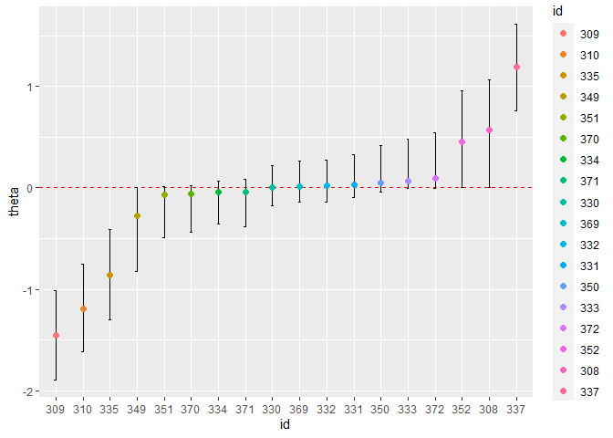
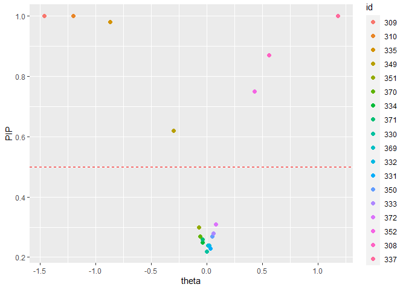
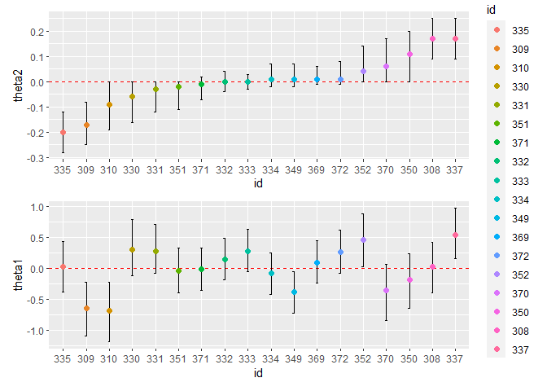
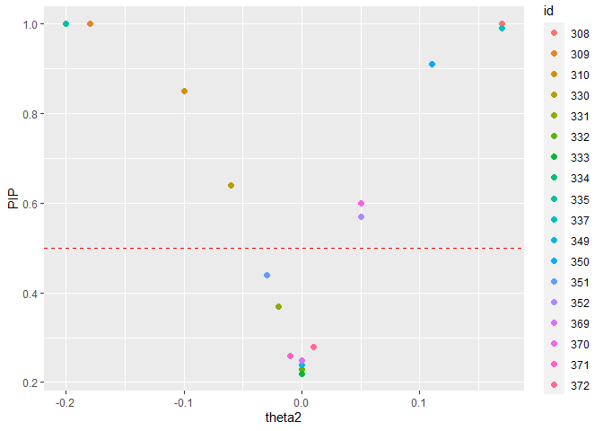

<!-- README.md is generated from README.Rmd. Please edit that file -->

# SSranef

<!-- badges: start -->
<!-- badges: end -->

SSranef is an R package for random effects selection that corresponds to
the models described in Rodriguez, Williams, and Rast (2021).
Specifically, `ss_ranef_alpha()` fits a random intercepts model with a
spike-and-slab prior on the random effects, and `ss_ranef_beta()` fits a
model with both random intercepts and random slopes, with a
spike-and-slab prior on the random effects for the slope.

## Installation

This package can be installed with

``` r
# install.packages("devtools")
devtools::install_github("josue-rodriguez/SSranef")
```

## Example

Because `SSranef` uses JAGS as a backend, we must also load the `rjags`
package.

``` r
library(SSranef)
library(rjags)
#> Loading required package: coda
#> Linked to JAGS 4.3.0
#> Loaded modules: basemod,bugs

d <- lme4::sleepstudy
```

## Alpha model

``` r
d$y <- c(scale(d$Reaction))

alpha <- ss_ranef_alpha(y = d$y, unit = d$Subject)
#> Compiling model graph
#>    Resolving undeclared variables
#>    Allocating nodes
#> Graph information:
#>    Observed stochastic nodes: 180
#>    Unobserved stochastic nodes: 39
#>    Total graph size: 486
#> 
#> Initializing model

posterior_summary(alpha, ci = 0.90, digits = 2)
#> Linear mixed model fit with SSranef
#> Call: ss_ranef_alpha(y = d$y, unit = d$Subject)
#> 
#>       Post.mean q05   q95 
#> alpha 0.09      -0.07 0.26
#> sigma 0.79       0.72 0.87
#> tau   0.97       0.61 1.45
```

``` r
ranef_summary(alpha, ci = 0.95, digits = 2)
#> Linear mixed model fit with SSranef
#> Call: ss_ranef_alpha(y = d$y, unit = d$Subject)
#> 
#>           Post.mean q025  q975  PIP  BF_10   BF_01
#> theta_308  0.56      0.00  1.12 0.87    6.81 0.15 
#> theta_309 -1.46     -2.00 -0.94 1.00     Inf 0.00 
#> theta_310 -1.20     -1.72 -0.66 1.00 1999.00 0.00 
#> theta_330  0.00     -0.33  0.30 0.22    0.29 3.50 
#> theta_331  0.03     -0.22  0.42 0.23    0.30 3.29 
#> theta_332  0.02     -0.26  0.39 0.24    0.31 3.25 
#> theta_333  0.06     -0.12  0.57 0.28    0.40 2.51 
#> theta_334 -0.04     -0.49  0.18 0.25    0.33 3.05 
#> theta_335 -0.87     -1.42 -0.27 0.98   56.97 0.02 
#> theta_337  1.18      0.66  1.69 1.00     Inf 0.00 
#> theta_349 -0.30     -0.93  0.00 0.62    1.64 0.61 
#> theta_350  0.05     -0.17  0.55 0.27    0.37 2.72 
#> theta_351 -0.07     -0.61  0.10 0.30    0.42 2.38 
#> theta_352  0.43      0.00  1.04 0.75    2.96 0.34 
#> theta_369  0.01     -0.28  0.37 0.24    0.31 3.21 
#> theta_370 -0.06     -0.56  0.11 0.27    0.36 2.74 
#> theta_371 -0.04     -0.49  0.18 0.26    0.36 2.80 
#> theta_372  0.08     -0.09  0.61 0.31    0.45 2.22
```

``` r
caterpillar_plot(alpha)
```



``` r
pip_plot(alpha)
```



## Beta model

``` r
beta <- ss_ranef_beta(y = d$y, X = d$Days, unit = d$Subject)
#> Compiling model graph
#>    Resolving undeclared variables
#>    Allocating nodes
#> Graph information:
#>    Observed stochastic nodes: 180
#>    Unobserved stochastic nodes: 60
#>    Total graph size: 1316
#> 
#> Initializing model
posterior_summary(beta, digits = 2)
#> Linear mixed model fit with SSranef
#> Call: ss_ranef_beta(y = d$y, X = d$Days, unit = d$Subject)
#> 
#>       Post.mean q05   q95  
#> alpha -0.83     -1.02 -0.66
#> beta   0.19      0.15  0.22
#> sigma  0.47      0.42  0.52
#> tau1   0.43      0.23  0.68
#> tau2   0.18      0.10  0.33
#> rho    0.14     -0.53  0.85
```

``` r
ranef_summary(beta, digits = 2)
#> Linear mixed model fit with SSranef
#> Call: ss_ranef_beta(y = d$y, X = d$Days, unit = d$Subject)
#> 
#>            Post.mean q05   q95   PIP  BF_10  BF_01
#> theta1_308  0.01     -0.41  0.39   NA     NA   NA 
#> theta1_309 -0.62     -1.15 -0.20   NA     NA   NA 
#> theta1_310 -0.65     -1.20 -0.20   NA     NA   NA 
#> theta1_330  0.28     -0.11  0.78   NA     NA   NA 
#> theta1_331  0.24     -0.09  0.66   NA     NA   NA 
#> theta1_332  0.14     -0.17  0.47   NA     NA   NA 
#> theta1_333  0.27     -0.05  0.60   NA     NA   NA 
#> theta1_334 -0.07     -0.40  0.25   NA     NA   NA 
#> theta1_335  0.01     -0.39  0.46   NA     NA   NA 
#> theta1_337  0.54      0.15  1.05   NA     NA   NA 
#> theta1_349 -0.37     -0.71 -0.05   NA     NA   NA 
#> theta1_350 -0.17     -0.64  0.23   NA     NA   NA 
#> theta1_351 -0.03     -0.37  0.35   NA     NA   NA 
#> theta1_352  0.42      0.01  0.83   NA     NA   NA 
#> theta1_369  0.09     -0.23  0.41   NA     NA   NA 
#> theta1_370 -0.33     -0.82  0.07   NA     NA   NA 
#> theta1_371 -0.04     -0.36  0.28   NA     NA   NA 
#> theta1_372  0.26     -0.08  0.60   NA     NA   NA 
#> theta2_308  0.17      0.08  0.26 1.00 234.29 0.00 
#> theta2_309 -0.17     -0.26 -0.06 0.96  27.57 0.04 
#> theta2_310 -0.10     -0.20  0.00 0.79   3.82 0.26 
#> theta2_330 -0.06     -0.16  0.00 0.63   1.71 0.58 
#> theta2_331 -0.02     -0.11  0.00 0.38   0.62 1.62 
#> theta2_332  0.00     -0.05  0.03 0.24   0.31 3.18 
#> theta2_333  0.00     -0.04  0.03 0.22   0.28 3.57 
#> theta2_334  0.00     -0.02  0.06 0.23   0.30 3.36 
#> theta2_335 -0.20     -0.28 -0.12 1.00 332.33 0.00 
#> theta2_337  0.17      0.07  0.25 0.96  24.64 0.04 
#> theta2_349  0.01     -0.03  0.07 0.26   0.35 2.87 
#> theta2_350  0.10      0.00  0.21 0.86   6.13 0.16 
#> theta2_351 -0.03     -0.12  0.00 0.44   0.79 1.26 
#> theta2_352  0.04      0.00  0.14 0.55   1.23 0.81 
#> theta2_369  0.01     -0.02  0.06 0.25   0.34 2.94 
#> theta2_370  0.06      0.00  0.17 0.61   1.53 0.65 
#> theta2_371 -0.01     -0.06  0.01 0.23   0.29 3.42 
#> theta2_372  0.01     -0.01  0.08 0.28   0.39 2.57
```

``` r
caterpillar_plot(beta)
```



``` r
pip_plot(beta)
```



## Priors

Priors can be passed on to either of the `ss_ranef` functions through a
named list and using JAGS code, e.g.,

``` r
# change prior for mean intercept
priors <- list(alpha = "alpha ~ dt(0, 1, 3)",
               # for each jth unit, change prior probability of inclusion
               gamma = "gamma[j] ~ dbern(0.75)") 

fit <- ss_ranef_alpha(y = d$y, unit = d$Subject, priors = priors)
#> Compiling model graph
#>    Resolving undeclared variables
#>    Allocating nodes
#> Graph information:
#>    Observed stochastic nodes: 180
#>    Unobserved stochastic nodes: 39
#>    Total graph size: 485
#> 
#> Initializing model
ranef_summary(fit)
#> Linear mixed model fit with SSranef
#> Call: ss_ranef_alpha(y = d$y, unit = d$Subject, priors = priors)
#> 
#>           Post.mean q05   q95   PIP  BF_10  BF_01
#> theta_308  0.61      0.00  1.08 0.95  18.42 0.05 
#> theta_309 -1.39     -1.82 -0.93 1.00    Inf 0.00 
#> theta_310 -1.14     -1.57 -0.71 1.00    Inf 0.00 
#> theta_330  0.01     -0.32  0.36 0.48   0.94 1.06 
#> theta_331  0.07     -0.22  0.47 0.53   1.12 0.89 
#> theta_332  0.05     -0.24  0.43 0.53   1.15 0.87 
#> theta_333  0.15     -0.12  0.60 0.60   1.53 0.66 
#> theta_334 -0.06     -0.47  0.23 0.55   1.23 0.81 
#> theta_335 -0.83     -1.26 -0.38 0.99 147.15 0.01 
#> theta_337  1.17      0.74  1.61 1.00    Inf 0.00 
#> theta_349 -0.35     -0.83  0.00 0.82   4.48 0.22 
#> theta_350  0.11     -0.15  0.53 0.57   1.35 0.74 
#> theta_351 -0.12     -0.56  0.15 0.60   1.47 0.68 
#> theta_352  0.52      0.00  0.97 0.91  10.43 0.10 
#> theta_369  0.04     -0.28  0.42 0.51   1.05 0.95 
#> theta_370 -0.10     -0.52  0.17 0.56   1.28 0.78 
#> theta_371 -0.06     -0.46  0.22 0.54   1.16 0.86 
#> theta_372  0.18     -0.08  0.65 0.63   1.67 0.60
```

## Building on top of SSranef models

The code for each model can also be extracted to make more extensive
modifications or build more complex models

``` r
jags_model_text <- fit$model_text
cat(jags_model_text)
#> model{
#>   for (i in 1:N) {
#>     # likelihood
#>     y[i] ~ dnorm(alpha_j[unit[i]], precision)
#>   }
#>   for (j in 1:J) {
#>     gamma[j] ~ dbern(0.75)
#>     # non-centered parameterization
#>     alpha_raw[j] ~ dnorm(0, 1)
#>     theta[j] <- tau * alpha_raw[j] * gamma[j]
#>     alpha_j[j] <- alpha + theta[j]
#>     lambda[j] <- (tau^2 / (tau^2 + sigma^2/n_j[j])) * gamma[j]
#>   }
#>   alpha ~ dt(0, 1, 3)
#>   tau ~ dt(0, 1, 3)T(0, )
#>   precision <- pow(sigma, -2)
#>   sigma ~ dt(0, 1, 3)T(0, )
#> }
```
