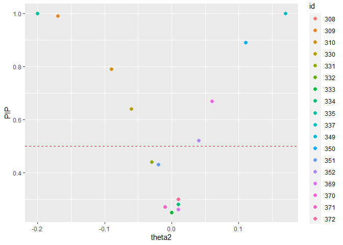

<!-- README.md is generated from README.Rmd. Please edit that file -->

# SSranef

<!-- badges: start -->
<!-- badges: end -->

SSranef is an R package for random effects selection that corresponds to
the models described in Rodriguez, Williams, and Rast (2021).
Specifically, `ss_ranef_alpha()` fits a random intercepts model with a
spike-and-slab prior on the random effects, and `ss_ranef_beta()` fits a
model with both random intercepts and random slopes, with a
spike-and-slab prior on the random effects for the slope.

## Installation

This package can be installed with

``` r
# install.packages("devtools")
devtools::install_github("josue-rodriguez/SSranef")
```

## Example

Because `SSranef` uses JAGS as a backend, we must also load the `rjags`
package.

``` r
library(SSranef)
library(rjags)
#> Loading required package: coda
#> Linked to JAGS 4.3.0
#> Loaded modules: basemod,bugs

d <- lme4::sleepstudy
```

## Alpha model

``` r
d$y <- c(scale(d$Reaction))

alpha <- ss_ranef_alpha(y = d$y, unit = d$Subject)
#> Compiling model graph
#>    Resolving undeclared variables
#>    Allocating nodes
#> Graph information:
#>    Observed stochastic nodes: 180
#>    Unobserved stochastic nodes: 39
#>    Total graph size: 486
#> 
#> Initializing model

posterior_summary(alpha, ci = 0.90, digits = 2)
#> Linear mixed model fit with SSranef
#> Call: ss_ranef_alpha(y = d$y, unit = d$Subject)
#> 
#>       Post.mean q05   q95 
#> alpha 0.08      -0.08 0.24
#> sigma 0.79       0.72 0.86
#> tau   0.95       0.62 1.41
```

``` r
ranef_summary(alpha, ci = 0.95, digits = 2)
#> Linear mixed model fit with SSranef
#> Call: ss_ranef_alpha(y = d$y, unit = d$Subject)
#> 
#>           Post.mean q025  q975  PIP  BF_10   BF_01
#> theta_308  0.57      0.00  1.13 0.88    7.33 0.14 
#> theta_309 -1.44     -1.96 -0.92 1.00     Inf 0.00 
#> theta_310 -1.18     -1.70 -0.68 1.00 3999.00 0.00 
#> theta_330  0.00     -0.31  0.32 0.24    0.31 3.22 
#> theta_331  0.03     -0.20  0.45 0.25    0.33 3.04 
#> theta_332  0.02     -0.23  0.42 0.23    0.31 3.26 
#> theta_333  0.07     -0.11  0.60 0.30    0.43 2.30 
#> theta_334 -0.04     -0.49  0.17 0.25    0.34 2.98 
#> theta_335 -0.87     -1.38 -0.32 0.99  116.65 0.01 
#> theta_337  1.19      0.69  1.69 1.00 1999.00 0.00 
#> theta_349 -0.28     -0.92  0.00 0.60    1.47 0.68 
#> theta_350  0.06     -0.15  0.57 0.29    0.40 2.49 
#> theta_351 -0.07     -0.57  0.14 0.31    0.44 2.28 
#> theta_352  0.46      0.00  1.06 0.80    4.13 0.24 
#> theta_369  0.01     -0.26  0.37 0.23    0.30 3.30 
#> theta_370 -0.06     -0.56  0.14 0.29    0.41 2.42 
#> theta_371 -0.04     -0.47  0.16 0.26    0.34 2.90 
#> theta_372  0.09     -0.10  0.63 0.34    0.52 1.92
```

``` r
caterpillar_plot(alpha)
```


``` r
pip_plot(alpha)
```


## Beta model

``` r
beta <- ss_ranef_beta(y = d$y, X = d$Days, unit = d$Subject)
#> Compiling model graph
#>    Resolving undeclared variables
#>    Allocating nodes
#> Graph information:
#>    Observed stochastic nodes: 180
#>    Unobserved stochastic nodes: 60
#>    Total graph size: 1316
#> 
#> Initializing model
posterior_summary(beta, digits = 2)
#> Linear mixed model fit with SSranef
#> Call: ss_ranef_beta(y = d$y, X = d$Days, unit = d$Subject)
#> 
#>       Post.mean q05   q95  
#> alpha -0.85     -1.05 -0.64
#> beta   0.19      0.15  0.23
#> sigma  0.47      0.43  0.52
#> tau1   0.42      0.23  0.67
#> tau2   0.17      0.10  0.34
#> rho    0.17     -0.37  0.83
```

``` r
ranef_summary(beta, digits = 2)
#> Linear mixed model fit with SSranef
#> Call: ss_ranef_beta(y = d$y, X = d$Days, unit = d$Subject)
#> 
#>            Post.mean q05   q95   PIP  BF_10  BF_01
#> theta1_308  0.03     -0.39  0.40   NA     NA   NA 
#> theta1_309 -0.59     -1.05 -0.19   NA     NA   NA 
#> theta1_310 -0.63     -1.14 -0.19   NA     NA   NA 
#> theta1_330  0.30     -0.10  0.81   NA     NA   NA 
#> theta1_331  0.26     -0.10  0.71   NA     NA   NA 
#> theta1_332  0.14     -0.19  0.48   NA     NA   NA 
#> theta1_333  0.26     -0.05  0.60   NA     NA   NA 
#> theta1_334 -0.07     -0.38  0.23   NA     NA   NA 
#> theta1_335  0.02     -0.38  0.46   NA     NA   NA 
#> theta1_337  0.55      0.16  0.99   NA     NA   NA 
#> theta1_349 -0.36     -0.72 -0.04   NA     NA   NA 
#> theta1_350 -0.15     -0.61  0.29   NA     NA   NA 
#> theta1_351 -0.04     -0.39  0.36   NA     NA   NA 
#> theta1_352  0.43      0.00  0.86   NA     NA   NA 
#> theta1_369  0.10     -0.21  0.43   NA     NA   NA 
#> theta1_370 -0.31     -0.79  0.08   NA     NA   NA 
#> theta1_371 -0.04     -0.37  0.29   NA     NA   NA 
#> theta1_372  0.26     -0.06  0.62   NA     NA   NA 
#> theta2_308  0.17      0.09  0.25 1.00 499.00 0.00 
#> theta2_309 -0.18     -0.26 -0.08 0.99  84.11 0.01 
#> theta2_310 -0.11     -0.20  0.00 0.86   6.33 0.16 
#> theta2_330 -0.06     -0.16  0.00 0.66   1.93 0.52 
#> theta2_331 -0.02     -0.12  0.00 0.41   0.68 1.46 
#> theta2_332  0.00     -0.04  0.03 0.24   0.31 3.24 
#> theta2_333  0.00     -0.04  0.05 0.26   0.36 2.79 
#> theta2_334  0.01     -0.02  0.06 0.24   0.32 3.09 
#> theta2_335 -0.20     -0.28 -0.12 1.00    Inf 0.00 
#> theta2_337  0.17      0.08  0.25 0.98  43.44 0.02 
#> theta2_349  0.00     -0.03  0.07 0.27   0.37 2.72 
#> theta2_350  0.10      0.00  0.20 0.86   6.09 0.16 
#> theta2_351 -0.02     -0.11  0.00 0.41   0.70 1.44 
#> theta2_352  0.04      0.00  0.14 0.56   1.27 0.78 
#> theta2_369  0.00     -0.02  0.06 0.24   0.31 3.18 
#> theta2_370  0.05      0.00  0.16 0.58   1.39 0.72 
#> theta2_371  0.00     -0.06  0.01 0.24   0.32 3.13 
#> theta2_372  0.01     -0.02  0.07 0.28   0.39 2.55
```

``` r
caterpillar_plot(beta)
```


``` r
pip_plot(beta)
```



## Priors

Priors can be passed on to either of the `ss_ranef` functions through a
named list and using JAGS code, e.g.,

``` r
# change prior for mean intercept
priors <- list(alpha = "alpha ~ dt(0, 1, 3)")

fit <- ss_ranef_alpha(y = d$y, unit = d$Subject, priors = priors)
#> Compiling model graph
#>    Resolving undeclared variables
#>    Allocating nodes
#> Graph information:
#>    Observed stochastic nodes: 180
#>    Unobserved stochastic nodes: 39
#>    Total graph size: 485
#> 
#> Initializing model
ranef_summary(fit)
#> Linear mixed model fit with SSranef
#> Call: ss_ranef_alpha(y = d$y, unit = d$Subject, priors = priors)
#> 
#>           Post.mean q05   q95   PIP  BF_10  BF_01
#> theta_308  0.57      0.00  1.05 0.88   7.42 0.13 
#> theta_309 -1.45     -1.88 -1.00 1.00    Inf 0.00 
#> theta_310 -1.19     -1.62 -0.76 1.00 999.00 0.00 
#> theta_330  0.00     -0.18  0.18 0.20   0.26 3.91 
#> theta_331  0.03     -0.12  0.33 0.25   0.33 3.07 
#> theta_332  0.02     -0.12  0.27 0.23   0.30 3.33 
#> theta_333  0.07      0.00  0.47 0.28   0.39 2.59 
#> theta_334 -0.03     -0.34  0.07 0.23   0.31 3.27 
#> theta_335 -0.86     -1.29 -0.41 0.99  92.02 0.01 
#> theta_337  1.19      0.77  1.63 1.00    Inf 0.00 
#> theta_349 -0.28     -0.83  0.00 0.59   1.46 0.69 
#> theta_350  0.05     -0.01  0.40 0.26   0.35 2.87 
#> theta_351 -0.08     -0.49  0.03 0.32   0.48 2.10 
#> theta_352  0.45      0.00  0.96 0.78   3.63 0.28 
#> theta_369  0.01     -0.13  0.25 0.22   0.29 3.48 
#> theta_370 -0.06     -0.45  0.03 0.28   0.39 2.55 
#> theta_371 -0.04     -0.35  0.07 0.25   0.34 2.94 
#> theta_372  0.08      0.00  0.52 0.31   0.46 2.18
```

## Building on top of SSranef models

The code for each model can also be extracted to make more extensive
modifications or build more complex models

``` r
jags_model_text <- fit$model_text
cat(jags_model_text)
#> model{
#>   for (i in 1:N) {
#>     # likelihood
#>     y[i] ~ dnorm(alpha_j[unit[i]], precision)
#>   }
#>   for (j in 1:J) {
#>     gamma[j] ~ dbern(0.5)
#>     # non-centered parameterization
#>     alpha_raw[j] ~ dnorm(0, 1)
#>     theta[j] <- tau * alpha_raw[j] * gamma[j]
#>     alpha_j[j] <- alpha + theta[j]
#>     lambda[j] <- (tau^2 / (tau^2 + sigma^2/n_j[j])) * gamma[j]
#>   }
#>   alpha ~ dt(0, 1, 3)
#>   tau ~ dt(0, 1, 3)T(0, )
#>   precision <- pow(sigma, -2)
#>   sigma ~ dt(0, 1, 3)T(0, )
#> }
```
