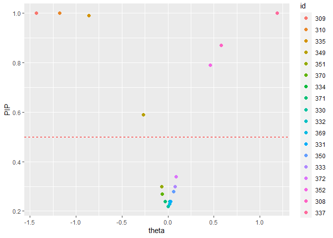

<!-- README.md is generated from README.Rmd. Please edit that file -->

# SSranef

<!-- badges: start -->
<!-- badges: end -->

SSranef is an R package for random effects selection that corresponds to
the models described in Rodriguez, Williams, and Rast (2021).
Specifically, `ss_ranef_alpha()` fits a random intercepts model with a
spike-and-slab prior on the random effects, and `ss_ranef_beta()` fits a
model with both random intercepts and random slopes, with a
spike-and-slab prior on the random effects for the slope.

## Installation

This package can be installed with

``` r
# install.packages("devtools")
devtools::install_github("josue-rodriguez/SSranef")
```

## Example

Because `SSranef` uses JAGS as a backend, we must also load the `rjags`
package.

``` r
library(SSranef)
#> Warning: replacing previous import 'Matrix::update' by 'stats::update' when
#> loading 'SSranef'
library(rjags)
#> Loading required package: coda
#> Linked to JAGS 4.3.0
#> Loaded modules: basemod,bugs

d <- lme4::sleepstudy
```

## Alpha model

``` r
d$y <- c(scale(d$Reaction))

alpha <- ss_ranef_alpha(y = d$y, unit = d$Subject)
#> Compiling model graph
#>    Resolving undeclared variables
#>    Allocating nodes
#> Graph information:
#>    Observed stochastic nodes: 180
#>    Unobserved stochastic nodes: 39
#>    Total graph size: 486
#> 
#> Initializing model

posterior_summary(alpha, ci = 0.90, digits = 2)
#>       Post.mean   q05  q95
#> alpha      0.09 -0.07 0.25
#> sigma      0.79  0.72 0.86
#> tau        0.98  0.61 1.55
```

``` r
ranef_summary(alpha, ci = 0.95, digits = 2)
#>           Post.mean  q025  q975  PIP BF_10 BF_01
#> theta_308      0.57  0.00  1.12 0.88  7.06  0.14
#> theta_309     -1.45 -1.98 -0.93 1.00   Inf  0.00
#> theta_310     -1.19 -1.71 -0.68 1.00   Inf  0.00
#> theta_330      0.00 -0.31  0.29 0.21  0.26  3.87
#> theta_331      0.02 -0.19  0.41 0.21  0.27  3.68
#> theta_332      0.02 -0.24  0.40 0.24  0.31  3.18
#> theta_333      0.06 -0.12  0.58 0.28  0.38  2.61
#> theta_334     -0.03 -0.46  0.18 0.23  0.30  3.30
#> theta_335     -0.87 -1.39 -0.29 0.99 79.00  0.01
#> theta_337      1.19  0.68  1.72 1.00   Inf  0.00
#> theta_349     -0.30 -0.92  0.00 0.62  1.65  0.61
#> theta_350      0.05 -0.15  0.52 0.27  0.37  2.68
#> theta_351     -0.08 -0.61  0.13 0.33  0.48  2.07
#> theta_352      0.43  0.00  1.06 0.76  3.23  0.31
#> theta_369      0.01 -0.28  0.36 0.23  0.30  3.33
#> theta_370     -0.06 -0.56  0.15 0.29  0.40  2.49
#> theta_371     -0.04 -0.47  0.17 0.24  0.32  3.16
#> theta_372      0.08 -0.10  0.62 0.32  0.47  2.13
```

``` r
caterpillar_plot(alpha)
```


``` r
pip_plot(alpha)
```



## Beta model

``` r
beta <- ss_ranef_beta(y = d$y, X = d$Days, unit = d$Subject)
#> Compiling model graph
#>    Resolving undeclared variables
#>    Allocating nodes
#> Graph information:
#>    Observed stochastic nodes: 180
#>    Unobserved stochastic nodes: 60
#>    Total graph size: 1316
#> 
#> Initializing model
posterior_summary(beta, digits = 2)
#>       Post.mean   q05   q95
#> alpha     -0.84 -1.04 -0.64
#> beta       0.18  0.15  0.22
#> sigma      0.47  0.42  0.52
#> tau1       0.42  0.24  0.64
#> tau2       0.16  0.10  0.26
#> rho        0.23 -0.37  0.78
```

``` r
ranef_summary(beta, digits = 2)
#>            Post.mean   q05   q95  PIP  BF_10 BF_01
#> theta1_308      0.03 -0.39  0.41   NA     NA    NA
#> theta1_309     -0.62 -1.06 -0.22   NA     NA    NA
#> theta1_310     -0.66 -1.18 -0.20   NA     NA    NA
#> theta1_330      0.28 -0.11  0.77   NA     NA    NA
#> theta1_331      0.25 -0.08  0.66   NA     NA    NA
#> theta1_332      0.15 -0.17  0.49   NA     NA    NA
#> theta1_333      0.27 -0.04  0.61   NA     NA    NA
#> theta1_334     -0.06 -0.40  0.27   NA     NA    NA
#> theta1_335      0.00 -0.37  0.42   NA     NA    NA
#> theta1_337      0.53  0.16  0.93   NA     NA    NA
#> theta1_349     -0.35 -0.70 -0.03   NA     NA    NA
#> theta1_350     -0.17 -0.63  0.27   NA     NA    NA
#> theta1_351     -0.04 -0.38  0.34   NA     NA    NA
#> theta1_352      0.43  0.01  0.85   NA     NA    NA
#> theta1_369      0.10 -0.23  0.42   NA     NA    NA
#> theta1_370     -0.33 -0.78  0.09   NA     NA    NA
#> theta1_371     -0.03 -0.34  0.30   NA     NA    NA
#> theta1_372      0.27 -0.08  0.60   NA     NA    NA
#> theta2_308      0.17  0.09  0.26 1.00 209.53  0.00
#> theta2_309     -0.17 -0.26 -0.08 0.98  52.33  0.02
#> theta2_310     -0.10 -0.20  0.00 0.80   4.13  0.24
#> theta2_330     -0.05 -0.15  0.00 0.63   1.71  0.58
#> theta2_331     -0.02 -0.11  0.00 0.36   0.56  1.79
#> theta2_332      0.00 -0.04  0.03 0.24   0.32  3.11
#> theta2_333      0.00 -0.03  0.04 0.22   0.28  3.61
#> theta2_334      0.01 -0.02  0.06 0.28   0.38  2.61
#> theta2_335     -0.19 -0.27 -0.12 1.00 665.67  0.00
#> theta2_337      0.17  0.10  0.25 1.00 332.33  0.00
#> theta2_349      0.00 -0.03  0.06 0.25   0.33  3.04
#> theta2_350      0.11  0.00  0.20 0.90   9.36  0.11
#> theta2_351     -0.02 -0.11  0.00 0.41   0.70  1.43
#> theta2_352      0.05  0.00  0.15 0.55   1.21  0.83
#> theta2_369      0.01 -0.02  0.06 0.27   0.37  2.67
#> theta2_370      0.06  0.00  0.17 0.64   1.78  0.56
#> theta2_371     -0.01 -0.06  0.02 0.27   0.37  2.72
#> theta2_372      0.01 -0.01  0.08 0.31   0.45  2.22
```

``` r
caterpillar_plot(beta)
```


``` r
pip_plot(beta)
```


## Multivariate model

Note, this currently only returns an MCMC list for the posterior samples

``` r
mv_data <- gen_mv_data(5, 5)
str(mv_data)
#> 'data.frame':    25 obs. of  4 variables:
#>  $ y1: num  1.82 -1.08 1.99 1.33 2.67 ...
#>  $ y2: num  3.19 4.2 1.29 4.82 4.57 ...
#>  $ x : num  1 1 0 1 1 0 1 1 0 0 ...
#>  $ id: Factor w/ 5 levels "1","2","3","4",..: 1 1 1 1 1 2 2 2 2 2 ...

mv_model <- ss_ranef_mv(Y = cbind(mv_data$y1, mv_data$y2),
                 X = mv_data$x,
                 unit = mv_data$id,
                 burnin = 100,
                 iter = 500,
                 chains = 4)
#> Compiling model graph
#>    Resolving undeclared variables
#>    Allocating nodes
#> Graph information:
#>    Observed stochastic nodes: 25
#>    Unobserved stochastic nodes: 23
#>    Total graph size: 336
#> 
#> Initializing model

summary(mv_model$posterior_samples)
#> 
#> Iterations = 1101:1600
#> Thinning interval = 1 
#> Number of chains = 4 
#> Sample size per chain = 500 
#> 
#> 1. Empirical mean and standard deviation for each variable,
#>    plus standard error of the mean:
#> 
#>               Mean       SD Naive SE Time-series SE
#> B[1,1]      3.3079  0.55985 0.012519       0.042063
#> B[2,1]      3.4334  0.36266 0.008109       0.026094
#> B[1,2]     -0.5599  1.42944 0.031963       0.190922
#> B[2,2]      2.2752  1.61750 0.036168       0.110484
#> Tau[1,1]   27.7153 91.22173 2.039780      12.028281
#> Tau[2,1]    8.4419 35.51598 0.794161       4.075112
#> Tau[3,1]   -1.6669 19.44536 0.434811       2.413064
#> Tau[4,1]    5.2527 21.05964 0.470908       2.234808
#> Tau[1,2]    8.4419 35.51598 0.794161       4.075112
#> Tau[2,2]   23.5221 21.26398 0.475477       0.749913
#> Tau[3,2]   -3.4442 15.67747 0.350559       2.259091
#> Tau[4,2]   15.1904 13.45124 0.300779       0.582903
#> Tau[1,3]   -1.6669 19.44536 0.434811       2.413064
#> Tau[2,3]   -3.4442 15.67747 0.350559       2.259091
#> Tau[3,3]    7.9472 15.92914 0.356186       1.878730
#> Tau[4,3]   -3.2265 14.54932 0.325333       2.673541
#> Tau[1,4]    5.2527 21.05964 0.470908       2.234808
#> Tau[2,4]   15.1904 13.45124 0.300779       0.582903
#> Tau[3,4]   -3.2265 14.54932 0.325333       2.673541
#> Tau[4,4]   12.7188 16.17367 0.361654       1.261238
#> gamma1[1]   0.5350  0.49890 0.011156       0.035438
#> gamma1[2]   0.9960  0.06313 0.001412       0.002225
#> gamma1[3]   0.1480  0.35519 0.007942       0.025505
#> gamma1[4]   0.9005  0.29941 0.006695       0.026798
#> gamma1[5]   0.8080  0.39397 0.008809       0.031625
#> gamma2[1]   0.6095  0.48798 0.010912       0.034047
#> gamma2[2]   0.7280  0.44510 0.009953       0.036067
#> gamma2[3]   0.8275  0.37791 0.008450       0.020980
#> gamma2[4]   0.9070  0.29051 0.006496       0.025600
#> gamma2[5]   0.7130  0.45247 0.010118       0.035725
#> rb[1,1]     1.0000  0.00000 0.000000       0.000000
#> rb[2,1]     0.2307  0.82865 0.018529       0.147038
#> rb[3,1]    -0.1414  0.74578 0.016676       0.103694
#> rb[4,1]     0.2236  0.81605 0.018247       0.147040
#> rb[1,2]     0.2307  0.82865 0.018529       0.147038
#> rb[2,2]     1.0000  0.00000 0.000000       0.000000
#> rb[3,2]    -0.1337  0.82512 0.018450       0.129443
#> rb[4,2]     0.9553  0.06206 0.001388       0.002436
#> rb[1,3]    -0.1414  0.74578 0.016676       0.103694
#> rb[2,3]    -0.1337  0.82512 0.018450       0.129443
#> rb[3,3]     1.0000  0.00000 0.000000       0.000000
#> rb[4,3]    -0.1227  0.81750 0.018280       0.133434
#> rb[1,4]     0.2236  0.81605 0.018247       0.147040
#> rb[2,4]     0.9553  0.06206 0.001388       0.002436
#> rb[3,4]    -0.1227  0.81750 0.018280       0.133434
#> rb[4,4]     1.0000  0.00000 0.000000       0.000000
#> rw          0.5717  0.15475 0.003460       0.006631
#> sigma[1]    1.5437  0.26852 0.006004       0.013425
#> sigma[2]    1.0213  0.17047 0.003812       0.008136
#> theta[1,1] -0.1657  3.55527 0.079498       0.247250
#> theta[2,1]  2.3253  6.90853 0.154479       1.437393
#> theta[3,1]  2.0361  6.35525 0.142108       1.398312
#> theta[4,1] -0.5520  3.27625 0.073259       0.411727
#> theta[5,1]  1.1174  3.49829 0.078224       0.589161
#> theta[1,2] -1.4883  3.25896 0.072872       0.153892
#> theta[2,2]  6.6348  1.80570 0.040377       0.175605
#> theta[3,2]  4.3865  3.92694 0.087809       0.235664
#> theta[4,2] -2.8960  1.87380 0.041900       0.188582
#> theta[5,2]  2.3383  2.46279 0.055070       0.230592
#> theta[1,3]  0.2861  1.88649 0.042183       0.252723
#> theta[2,3] -1.0963  3.93426 0.087973       0.682359
#> theta[3,3] -0.5691  3.11952 0.069755       0.387968
#> theta[4,3]  0.4376  1.97614 0.044188       0.314151
#> theta[5,3] -0.5344  2.06598 0.046197       0.248451
#> theta[1,4] -1.3794  2.25823 0.050496       0.079591
#> theta[2,4]  4.4858  2.44371 0.054643       0.295710
#> theta[3,4]  2.5788  2.53709 0.056731       0.116543
#> theta[4,4] -2.3588  1.72901 0.038662       0.107441
#> theta[5,4]  1.7371  2.18114 0.048772       0.274238
#> 
#> 2. Quantiles for each variable:
#> 
#>                 2.5%     25%     50%      75%     97.5%
#> B[1,1]       2.23903  2.9277  3.3098  3.68602   4.41566
#> B[2,1]       2.72147  3.1979  3.4334  3.67571   4.16260
#> B[1,2]      -2.79515 -1.4936 -0.7247  0.09726   3.57746
#> B[2,2]       0.01152  1.0697  1.7204  3.84187   5.35624
#> Tau[1,1]     0.21079  1.1663  4.0879 17.32410 228.85305
#> Tau[2,1]   -35.74590 -3.4724  2.5574 11.83400  89.31663
#> Tau[3,1]   -35.81636 -3.2460 -0.3874  1.60604  23.65427
#> Tau[4,1]   -21.78708 -2.3518  1.6979  8.39567  51.59111
#> Tau[1,2]   -35.74590 -3.4724  2.5574 11.83400  89.31663
#> Tau[2,2]     4.48148 10.7648 17.4621 28.72131  81.84318
#> Tau[3,2]   -40.37940 -8.6483 -1.1856  3.70699  24.00694
#> Tau[4,2]     2.94171  7.1517 11.4262 18.42091  50.49012
#> Tau[1,3]   -35.81636 -3.2460 -0.3874  1.60604  23.65427
#> Tau[2,3]   -40.37940 -8.6483 -1.1856  3.70699  24.00694
#> Tau[3,3]     0.20285  0.9778  2.6721  7.55104  48.98163
#> Tau[4,3]   -38.55678 -5.2527 -0.7392  2.45255  17.40032
#> Tau[1,4]   -21.78708 -2.3518  1.6979  8.39567  51.59111
#> Tau[2,4]     2.94171  7.1517 11.4262 18.42091  50.49012
#> Tau[3,4]   -38.55678 -5.2527 -0.7392  2.45255  17.40032
#> Tau[4,4]     2.04733  4.5535  7.6741 13.92980  59.63892
#> gamma1[1]    0.00000  0.0000  1.0000  1.00000   1.00000
#> gamma1[2]    1.00000  1.0000  1.0000  1.00000   1.00000
#> gamma1[3]    0.00000  0.0000  0.0000  0.00000   1.00000
#> gamma1[4]    0.00000  1.0000  1.0000  1.00000   1.00000
#> gamma1[5]    0.00000  1.0000  1.0000  1.00000   1.00000
#> gamma2[1]    0.00000  0.0000  1.0000  1.00000   1.00000
#> gamma2[2]    0.00000  0.0000  1.0000  1.00000   1.00000
#> gamma2[3]    0.00000  1.0000  1.0000  1.00000   1.00000
#> gamma2[4]    0.00000  1.0000  1.0000  1.00000   1.00000
#> gamma2[5]    0.00000  0.0000  1.0000  1.00000   1.00000
#> rb[1,1]      1.00000  1.0000  1.0000  1.00000   1.00000
#> rb[2,1]     -0.99279 -0.8105  0.7300  0.96841   0.99671
#> rb[3,1]     -0.99133 -0.8817 -0.3517  0.67436   0.98808
#> rb[4,1]     -0.98776 -0.7934  0.7059  0.95428   0.99370
#> rb[1,2]     -0.99279 -0.8105  0.7300  0.96841   0.99671
#> rb[2,2]      1.00000  1.0000  1.0000  1.00000   1.00000
#> rb[3,2]     -0.99401 -0.9535 -0.4777  0.81168   0.98835
#> rb[4,2]      0.79829  0.9480  0.9735  0.98622   0.99618
#> rb[1,3]     -0.99133 -0.8817 -0.3517  0.67436   0.98808
#> rb[2,3]     -0.99401 -0.9535 -0.4777  0.81168   0.98835
#> rb[3,3]      1.00000  1.0000  1.0000  1.00000   1.00000
#> rb[4,3]     -0.99323 -0.9382 -0.4531  0.83410   0.98475
#> rb[1,4]     -0.98776 -0.7934  0.7059  0.95428   0.99370
#> rb[2,4]      0.79829  0.9480  0.9735  0.98622   0.99618
#> rb[3,4]     -0.99323 -0.9382 -0.4531  0.83410   0.98475
#> rb[4,4]      1.00000  1.0000  1.0000  1.00000   1.00000
#> rw           0.21637  0.4829  0.5946  0.68513   0.81521
#> sigma[1]     1.09979  1.3479  1.5126  1.70090   2.16698
#> sigma[2]     0.74617  0.8970  1.0048  1.11980   1.42095
#> theta[1,1]  -6.03488 -1.2758 -0.1609  0.88909   5.89721
#> theta[2,1]  -8.19671 -1.3933  1.1495  4.06544  21.65329
#> theta[3,1]  -7.80958 -0.8183  0.7002  3.15927  20.12701
#> theta[4,1]  -7.30580 -1.7968 -0.4122  0.73259   5.48466
#> theta[5,1]  -4.11859 -0.5842  0.5143  2.03494  10.17125
#> theta[1,2]  -7.32618 -2.9542 -1.7213 -0.32029   6.46954
#> theta[2,2]   2.68089  5.5564  6.8096  7.91792   9.73132
#> theta[3,2]  -4.38114  1.6847  5.4502  7.14994  10.08024
#> theta[4,2]  -7.06490 -3.6445 -2.7588 -2.01384  -0.06026
#> theta[5,2]  -3.17550  1.3974  2.7663  3.84942   5.70358
#> theta[1,3]  -3.39920 -0.6571  0.1620  1.15613   4.21280
#> theta[2,3] -10.09608 -3.2901 -0.5564  1.40548   5.87232
#> theta[3,3]  -7.28166 -2.1629 -0.2820  1.18960   5.11235
#> theta[4,3]  -3.78982 -0.7133  0.2685  1.54173   4.71788
#> theta[5,3]  -5.70576 -1.4196 -0.2947  0.67202   2.98889
#> theta[1,4]  -5.08551 -3.1380 -1.2562 -0.17876   3.54476
#> theta[2,4]   1.47783  3.1642  3.9212  4.90883  11.68153
#> theta[3,4]  -4.02889  2.0413  3.4828  4.01611   5.16010
#> theta[4,4]  -5.64998 -3.7739 -1.8601 -1.18385  -0.11894
#> theta[5,4]  -2.42964  0.7720  1.8086  2.68245   6.85292
```

## Priors

Priors can be passed on to either of the `ss_ranef` functions through a
named list and using JAGS code, e.g.,

``` r
# change prior for mean intercept
priors <- list(alpha = "alpha ~ dt(0, 1, 3)",
               # for each jth unit, change prior probability of inclusion
               gamma = "gamma[j] ~ dbern(0.75)") 

fit <- ss_ranef_alpha(y = d$y, unit = d$Subject, priors = priors)
#> Compiling model graph
#>    Resolving undeclared variables
#>    Allocating nodes
#> Graph information:
#>    Observed stochastic nodes: 180
#>    Unobserved stochastic nodes: 39
#>    Total graph size: 485
#> 
#> Initializing model
ranef_summary(fit)
#>           Post.mean   q05   q95  PIP  BF_10 BF_01
#> theta_308      0.60  0.00  1.06 0.94  16.94  0.06
#> theta_309     -1.39 -1.85 -0.96 1.00    Inf  0.00
#> theta_310     -1.14 -1.58 -0.70 1.00    Inf  0.00
#> theta_330      0.01 -0.30  0.34 0.49   0.94  1.06
#> theta_331      0.07 -0.22  0.47 0.51   1.06  0.95
#> theta_332      0.04 -0.25  0.42 0.50   1.01  0.99
#> theta_333      0.15 -0.11  0.62 0.61   1.53  0.65
#> theta_334     -0.06 -0.46  0.21 0.53   1.14  0.88
#> theta_335     -0.83 -1.28 -0.39 1.00 284.71  0.00
#> theta_337      1.17  0.75  1.60 1.00    Inf  0.00
#> theta_349     -0.35 -0.83  0.00 0.81   4.31  0.23
#> theta_350      0.11 -0.14  0.54 0.56   1.28  0.78
#> theta_351     -0.12 -0.56  0.14 0.60   1.50  0.67
#> theta_352      0.54  0.00  0.98 0.93  13.55  0.07
#> theta_369      0.04 -0.26  0.39 0.51   1.04  0.96
#> theta_370     -0.11 -0.57  0.17 0.57   1.33  0.75
#> theta_371     -0.07 -0.48  0.20 0.53   1.12  0.89
#> theta_372      0.17 -0.10  0.63 0.63   1.69  0.59
```

## Building on top of SSranef models

The code for each model can also be extracted to make more extensive
modifications or build more complex models

``` r
jags_model_text <- fit$model_text
cat(jags_model_text)
#> model{
#>   for (i in 1:N) {
#>     # likelihood
#>     y[i] ~ dnorm(alpha_j[unit[i]], precision)
#>   }
#>   for (j in 1:J) {
#>     gamma[j] ~ dbern(0.75)
#>     # non-centered parameterization
#>     alpha_raw[j] ~ dnorm(0, 1)
#>     theta[j] <- tau * alpha_raw[j] * gamma[j]
#>     alpha_j[j] <- alpha + theta[j]
#>     lambda[j] <- (tau^2 / (tau^2 + sigma^2/n_j[j])) * gamma[j]
#>   }
#>   alpha ~ dt(0, 1, 3)
#>   tau ~ dt(0, 1, 3)T(0, )
#>   precision <- pow(sigma, -2)
#>   sigma ~ dt(0, 1, 3)T(0, )
#> }
```
